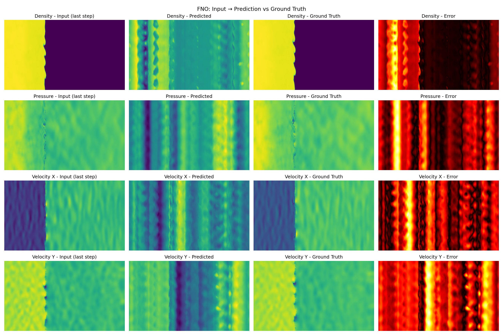
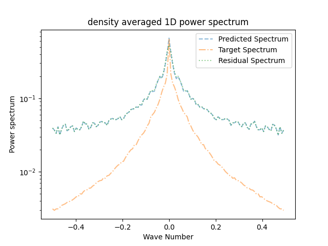

# TRL2D Surrogate — FNO Physics Surrogate Model

A Fourier Neural Operator (FNO) trained to predict turbulent 
radiative layer fluid dynamics from The Well dataset 
(PolymathicAI, NeurIPS 2024).

Given 4 consecutive snapshots of a turbulent fluid simulation, 
the model predicts the next timestep across 4 physical fields: 
density, pressure, velocity x, and velocity y.

---

## What This Is

Traditional fluid simulations are expensive — they run on 
supercomputers for hours. This surrogate model learns to mimic 
those simulations in milliseconds by training on thousands of 
pre-computed examples.

This is a baseline FNO implementation trained on the 
`turbulent_radiative_layer_2D` dataset — hot and cold gas 
mixing via Kelvin-Helmholtz instability, relevant to 
interstellar and circumgalactic medium physics.

---

## Model Predictions



*Left to right: Input (last frame) → Predicted → Ground Truth → Error*

The model performs well on velocity fields. Density and pressure 
show spectral bias artifacts consistent with small-batch FNO 
training — a known limitation of this architecture.

---

## Dataset

| Property | Value |
|---|---|
| Name | turbulent_radiative_layer_2D |
| Source | [The Well — PolymathicAI](https://github.com/PolymathicAI/the_well) |
| Size | 6.9 GB |
| Resolution | 384 × 128 |
| Trajectories | 90 |
| Timesteps | 101 per trajectory |
| Fields | density, pressure, velocity x, velocity y |

---

## Training Details

| Property | Value |
|---|---|
| Architecture | FNO (Fourier Neural Operator) |
| Hidden channels | 128 |
| Fourier modes | 16 × 16 |
| Input timesteps | 4 consecutive frames (16 channels) |
| Epochs | 200 |
| Best checkpoint | Epoch 77 |
| Best validation loss | 7.49 |
| Batch size | 4 |
| Learning rate | 1e-3 with cosine annealing |
| GPU | NVIDIA L4 24GB |
| Training time | ~17 hours |

---

## Usage

Install dependencies:

```bash
pip install the_well torch
```

Load and run the model:

```python
import torch
from the_well.benchmark.models import FNO
from the_well.data import WellDataset

# Load test data
testset = WellDataset(
    well_base_path='hf://datasets/polymathic-ai/',
    well_dataset_name='turbulent_radiative_layer_2D',
    well_split_name='test',
    n_steps_input=4,
)

sample = testset[0]
inp = sample['input_fields'].unsqueeze(0).cuda()
inp_cf = inp.squeeze(1).permute(0, 3, 1, 2).reshape(1, 16, 128, 384)

# Load model
checkpoint = torch.load('best.pt', map_location='cuda')

model = FNO(
    dim_in=16,
    dim_out=4,
    n_spatial_dims=2,
    spatial_resolution=(128, 384),
    modes1=16,
    modes2=16,
    hidden_channels=128,
).cuda()

model.load_state_dict(checkpoint['model_state_dict'])
model.eval()

with torch.no_grad():
    prediction = model(inp_cf)

print('Prediction shape:', prediction.shape)
# Output: [1, 4, 128, 384] — 4 fields at next timestep
```

Download the model checkpoint from 
[Hugging Face](https://huggingface.co/Sevenzoro321/trl2d-surrogate).

---

## Repository Structure
turbulent-radiative-surrogate/
├── src/                    # Training and evaluation scripts
├── configs/                # Model and training configs
├── notebooks/              # Data exploration notebooks
├── concepts/               # Learning notes
├── project/                # Project documentation
└── CLAUDE.md               # Project context for Claude Code

---

## Results

Power spectrum comparison (density field, epoch 200):



The model captures large-scale structure well. High-frequency 
spectral bias is a known FNO limitation — future work could 
explore U-Net or CNextU-Net architectures which outperform FNO 
on this dataset per the Well benchmark paper.

---

## Citation

```bibtex
@inproceedings{the_well_2024,
  title={The Well: a Large-Scale Collection of Diverse Physics 
         Simulations for Machine Learning},
  author={Ohana et al.},
  booktitle={NeurIPS 2024}
}
```

---

## Author

Built by [Sriram Reddy] (https://github.com/bs-reddy7) as a learning project. First ML model trained from scratch.

Hugging Face model: 
[Sevenzoro321/trl2d-surrogate](https://huggingface.co/Sevenzoro321/trl2d-surrogate)
